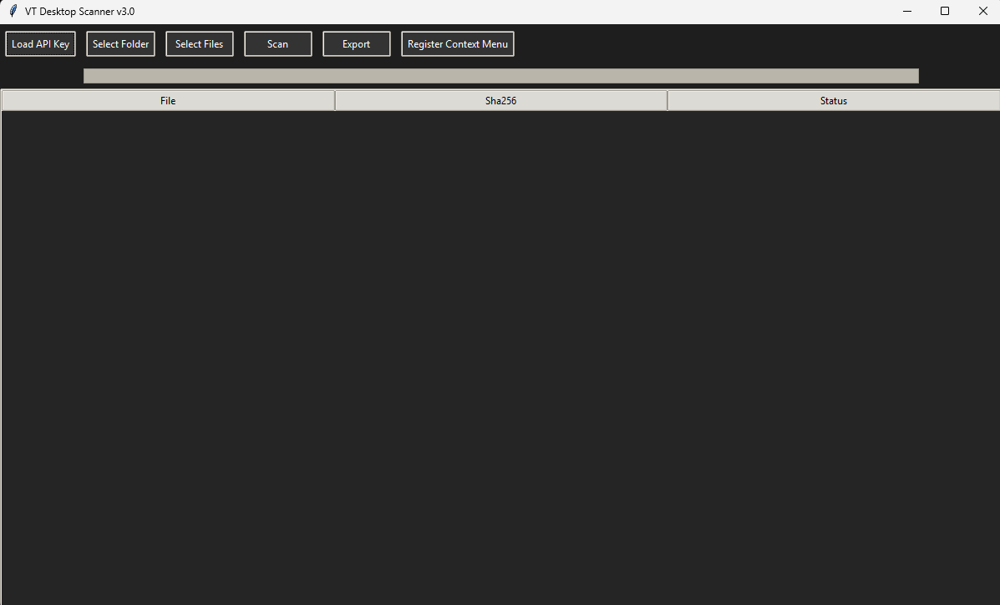
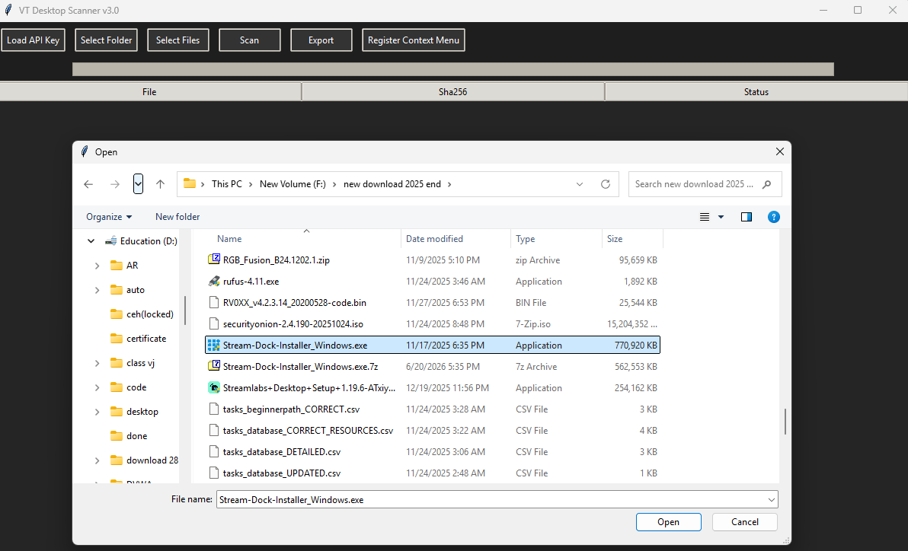
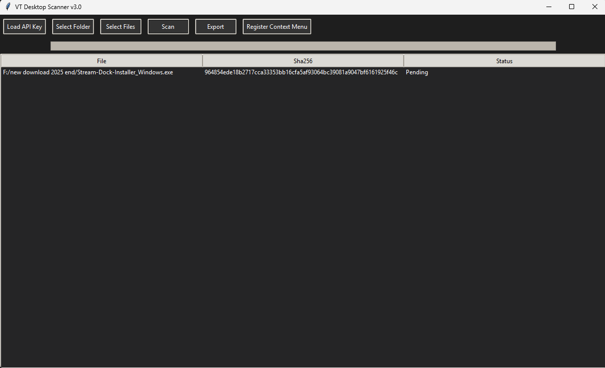
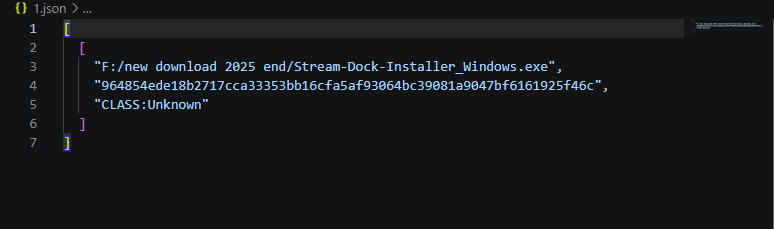

# VT-Desktop-Scanner

VT Desktop Scanner is a Python desktop application that scans files for potential malware using the VirusTotal API and local YARA rules. It supports scanning individual files or entire folders, securely stores the user's VirusTotal API key using encryption, and allows scan results to be exported for later analysis. This project was developed to explore malware analysis concepts, API integration, secure credential handling, and desktop application development using Python.

## Features

• Scan individual files or entire folders.
• Calculate SHA-256 hashes for scanned files.
• Check files against the VirusTotal API.
• Perform local malware detection using YARA rules.
• Securely encrypt and store the VirusTotal API key using Fernet encryption.
• Cache previous scan results to reduce unnecessary API requests.
• Handle VirusTotal API rate limits automatically.
• Export scan results in JSON and CSV formats.
• View detailed detection results from multiple antivirus engines.
• Windows desktop interface built with Tkinter.

## Technologies Used

• Python
• Tkinter
• VirusTotal API
• YARA
• Cryptography (Fernet)
• Requests
• Concurrent Futures
• JSON
• CSV

## Installation

Clone the repository:

git clone https://github.com/yourusername/VT-Desktop-Scanner.git

cd VT-Desktop-Scanner

Install the required packages:

pip install -r requirements.txt

Launch the application:

python vt_v1.py

## VirusTotal API Setup

This application requires a personal VirusTotal API key.
1. Create a free VirusTotal account.
2. Generate your personal API key.
3. Launch the application.
4. Enter your API key when prompted .
5. The application automatically generates a local encryption key (fernet.key) if one does not already exist.
6. Your API key is encrypted and stored locally in config.enc.

## ## VirusTotal API Rate Limiting

This application includes a 15-second delay between VirusTotal API requests when using the free API.

The free VirusTotal API enforces request rate limits to ensure fair usage. Introducing a delay helps prevent exceeding these limits and reduces the likelihood of receiving rate limit errors during file or folder scans.

If you are using a VirusTotal Premium API key, this delay can be adjusted or removed depending on your available API quota.

## How It Works

1. Select a file or folder to scan.
2. The application calculates the SHA-256 hash of each file.
3. If a cached result exists, it is displayed immediately.
4. Otherwise, the file hash is checked against VirusTotal.
5. Local YARA rules are executed to identify known malware patterns.
6. Results from both sources are displayed in the application.
7. Reports can be exported as JSON or CSV files.

## Screenshots

### Main Interface

The main application window used to load the VirusTotal API key, select files or folders, start scans, export reports, and register the Windows context menu.

### Selecting a File

Choose an individual file or an entire folder for malware analysis.

### Completed Scan

Example of a completed scan showing the calculated SHA-256 hash and scan status.

### Exported Report

Scan results exported in JSON format for later analysis.

## Future Improvements

• PDF report generation
• File quarantine functionality
• Digital signature verification
• Drag-and-drop file scanning
• Scan history dashboard
• File entropy analysis
• Additional YARA rules
• Improved multithreaded scanning
• MITRE ATT&CK technique mapping

## Disclaimer

This project is intended for educational purposes and security research. Detection results should be reviewed alongside other security tools before making security decisions.
